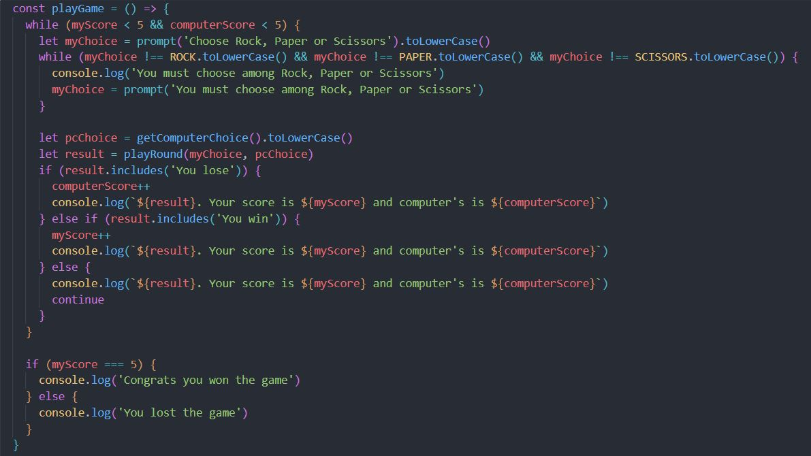
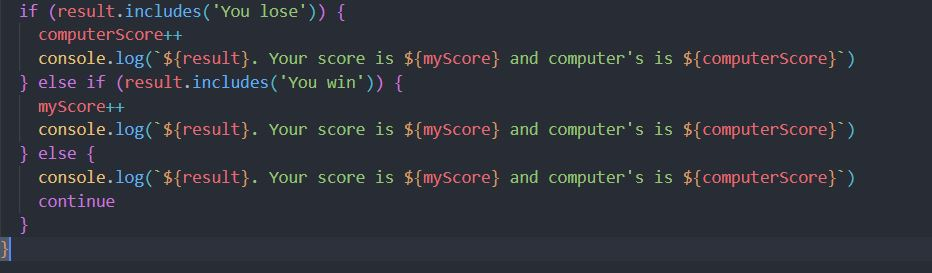
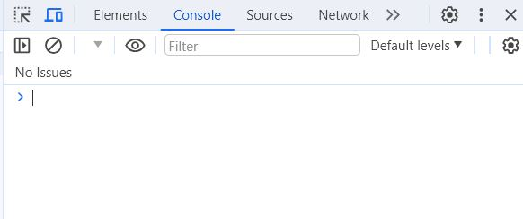

# Rock-Paper-Scissors-TOP-Console

First JS project for TOP. Console game RPS.

# What the project is about

This project is supposed to simulate a game of Rock, Paper Scissors against a computer.
The game is played through the browser console using a prompt when then page loads.

# What have I learned so far?

In this project I started implementing the basics of programming languages using JavaScript.
Below you can read what concepts I implemented during this project.

<ul>
  <li>Loading of scripts</li>
  <li>Use of variables, constants and functions</li>
  <li>Use of native methods from JavaScript like Math.</li>
  <li>If/else blocks & switch cases</li>
  <li>Handling of scope to save data outside of functions</li>
  <li>Loops to avoid repeating code and handling corner cases</li>
</ul>

# Explanation of the code

The code initialises by using an event telling the DOM to wait for the scripts to load before allowing interaction from the user, after which we find an arrow function.

This function's purpose is to simulate a computer choice of Rock, Paper or Scissors by generating a random number between 1 and 3 and returning a string which depends on the number generated.
1 will result in Rock being chosen, two will result in Paper and 3 will result in Scissors.

This function handles all the possible outcomes of a round of Rock, Paper, Scissors through a switch statement in order to avoid exessive use of if/else blocks as well as there not being need of an "else" case, just "else ifs". It recieves as parameters, the choice made by the user and the choice randomly made by the computer.

Here we can see some variables and constants. The variables' purpose is to keep the score of the game while the constants are simply used in the next function to apply some conditions under which the program should reprompt a user's input.

This function handles the full game.

It starts with a loop what will execute until the user's or the computer's score reaches 5.

Inside the loop the user is asked to input rock, paper or scissors through a prompt and the input is saved in a variable. Notice that the result is saved in lowercase in order to ignore users altering between upper and lowercase.

Next there's a nested loop which handles a scenario in which the user does not input any of the three options by comparing them to the previously declared constants making sure to compare them in lowercase.

If the user has not put a valid input, the loop will reprompt the input which will make clear the three available options.

Following this, we call the previously declared function to get a random choice from the computer and transform the value to lowercase. We save this result into a variable as well.

We also save into a variable the result of calling the round simulation function (where the switch statement was used) and we pass the user's choice and the computer's choice as paramenters.

The next if-else block, handles the three possible scenarios of the round (winning, losing or tieing). By checking what is saved in the previous variable (the includes method was used) it does three possible things:

If the computer beat the user it will increase the computer's score by one (look at the variables and constants before this function) and will log on the console a message stating the result of the round, as well as the total score of the game.

On the other hand, if the user beat the pc, the player's score increases by one and the message in the console provides the same information as with the previous case.

If it's a tie (which is the only other option), neither variable will be updated but there will be a message on the console stating the result of the round

Once the loop finishes, the function checks the state of the variables. If the user's score is 5, it displays a message on the console stating the user's triumph. If it's not the case, it's assumed the computer has beaten the user and states a message informing the user that the game was lost.

Finally we call the previous function so the game starts.

# Want to see it in action?

<a href="https://hroglardev.github.io/Rock-Paper-Scissors-TOP-Console/" target="_blank">Click here</a> and open the developer tools by pressing f12 (if you're using chrome). Then go to the console tab of the tools as shown in the image.

# Want to track my progress?

Checkout my other projects in order to see my evolution:

<ol>
  <li><a href="https://github.com/hroglardev/odin-recipes" target="_blank">Recipes</a></li>
  <li><a href="https://github.com/hroglardev/Odin-landing-page" target="_blank">Landing Page</a></li>
  <li><a href="https://github.com/hroglardev/Rock-Paper-Scissors-TOP-Console" target="_blank">You are here</a></li>
  <li><a href="https://github.com/hroglardev/Rock-Paper-Scissors-TOP" target="_blank">Rock, Paper, Scissors</a></li>
</ol>
